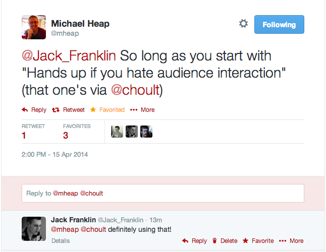
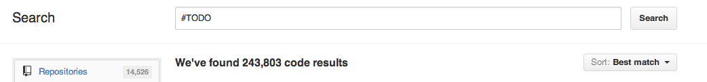

# Archictecting is Difficult

@Jack_Franklin

---

> Any fool can write code that a computer can understand. Good programmers write code that humans can understand.

-- Martin Fowler.

---

## What makes code difficult to work with?

---

## You're never going to get it right first time

---

> Defer concrete decisions as late as possible - you'll never again know less about the problem than you do right now and the correct abstraction will become clearer over time.

-- Andy Appleton

---

# Tests

---

# drive your API design

you can try things out at no cost

---

# difficult to test? difficult to use

a good sign something isn't quite right


---

# confidence when refactoring (more on this later)

you'll know when you broke something

---

# Naming Conventions

---

> There are only two hard things in Computer Science: cache invalidation and naming things.

-- Phil Karlton

---

> There are only two hard things in Computer Science: cache invalidation, naming things and off by one errors.

-- ??

---

# prefer verbosity

because auto complete

---

# be consistent

use the same nouns and verbs

---

# Coding Standards

[http://editorconfig.org ](http://editorconfig.org)

Pick a standard and stick to it

---

# Single Responsibility

---

# Do one thing

And do it well

---

# Not good

```ruby
class EmailSender
    def initialize(csv)
    def parse_csv_for_emails
    def send_email
end
```

---

# Better

```ruby
class EmailSender
    def initialize(csv)
    def parse_csv_for_emails
        Parser.new(csv).emails
    def send_email
end

class Parser
    def initialize(csv)
    def emails
end
```
---

# Decoupled Components

---

# Ye know too much

```ruby
class EmailSender
    def initialize(csv)
    def parse_csv_for_emails
        Parser.new(csv).emails
    def send_email
end

class Parser
    def initialize(csv)
    def emails
end
```

---

# Ignorance is bliss

```ruby
class EmailSender
    def initialize(emails)
    def send_email
end

class Parser
    def initialize(csv)
    def emails
end

emails = Parser.new(csv).emails
EmailSender.new(emails).send_email
```

---

# Separate Aggressively

---

# don't be afraid to create classes / objects

It's easier to merge two small things than split one large thing

---

# Refactoring

---


---

# Refactoring

Alter code _without_ changing behaviour

You have to have tests!

---

# Code smells

Some code which _may_ indicate a problem

---

> You don't fix code smells. You look at them and see if they indicate a problem you can fix.

-- Joe Ferris

---

# Audience Participation

---



---

# Spot the smell 1

---

```js
var googleMapPin = function(x, y) {...};

var getLatLong = function(x, y) {...};

var user = {
    coordinates: [x, y];
};
```

---

# Data Clumps

Continually passing round two (or more) variables as arguments.

---

```js
var googleMapPin = function(coords) {...};

var getLatLong = function(coords) {...};

var user = {
    coordinates: coords
};

var coords = { x: 1, y: 2 };
```

---

# Implicit Knowledge

The relationship of x and y was implicit.

By extracting the `coords` object, we make it explicit.

---

# Implicit Knowledge

Seek to remove all implicit knowledge in a system.

If I was handing it over to you, what would I need to explain?

---

# Spot the smell 2

---

```js
var drawGraph = function(graphWidth, graphHeight) {
    var width = 165 + graphWidth;
    var height = 170.5 + graphHeight;
};
```

---

# Magic Numbers!

165? 170.2?

Implicit knowledge!

---

```js
var drawGraph = function(graphWidth, graphHeight) {
    var extra_graph_width_padding = 165;
    var extra_graph_height_padding = 170.5;
    var width = extra_graph_width_padding + graphWidth;
    var height = extra_graph_height_padding + graphHeight;
};
```

---

# Spot the smell 3

---

```html
<% if user != nil %>
    <h2><%= user.welcome_message %></h2>
<% else %>
    <h2>Please Sign In</h2>
<% end %>
```

---

# Checking for `nil`

(Or `undefined` / `null` in JS)

What does `nil` mean? __Nothing__.

---

# Checking for `nil`

Don't use it to stand in for something.

---

# Null Object Pattern

Avoids conditional checks.

---

```ruby
class GuestUser
    def welcome_message
        "Please Sign In"
end

user = current_user || GuestUser.new
```

View:

```html
<h2><%= user.welcome_message %></h2>
```

---

# Spot the smell 4

---

```javascript
var shouldScrollToBeginning = function(carousel) {
    if(carousel.isAtEnd()) {
        carousel.goToStart();
    }
};
```

---

# Tell, don't ask

This function refers to `carousel` three times. Is this the bes place for this code?

---

```javascript
var carousel = {
    ...
    startAgain: function() {
        if(this.isAtEnd()) {
            this.goToStart();
        }
    }
}
```

---

# Tell, don't ask

Move the behaviour to where it makes most sense.

---

# Publish and Subscribe

---

```javascript

var carousel = function(accordion) {
    start: function() {
        accordion.close();
    }
};

var accordion = {
    ...
}

```

---

# Ye know too much (again)

The carousel knows that when it starts, it needs the accordion to close. That seems a bit odd?

---

# Pub Sub!

```javascript
var carousel = function() {
    start: function() {
        event.publish('carousel_start');
    }
};

var accordion = {
    init: function() {
        event.subscribe('carousel_start', function() {
            this.close();
        });
    }
}
```

---

# Pub Sub!

Neither module knows about the existance of the other.

Easily extended.

---

# Spot the smell 5

---

```js
var someMethod = function() {
    doSomething();
    doSomethingMore();
    doAnotherThing();
    if(something) {
        ...
    }
    doSomethingElse();
    while(someOtherThing) {
        ...
    }
};
```

---

# Doing too much

Functions should be _small_, _reusable_ and _composable_.

---

# Spot the smell 6

---

```js
var carousel = function(width, height, images, arrowLeft, arrowRight, animationSpeed, loopBackOnEnd) {
    ...
}
```

---

# Too many parameters

```js
carousel(500, 400, someImages, 'a.left', 'a.right', 500, false);
```

Try to guess what each of those mean...

---

# Fix one

```js
var carousel = function(options) {
    var width = options.width;
    var height = options.height;
    ...
}

```

---

# But

If you need that many arguments, that might indicate the function is doing too much

---

# Getting into the habit

---

# Everytime you leave code, leave it a tiny bit _better_

Note: _better_. Not _best_.

---

# Don't leave comments

```ruby
#TODO: this entire class is screwed, fix it
```

```ruby
#todo REMOVE BEFORE PRODUCTION... SERIOUSLY!
```

```ruby
#todo: change once we have authentication
```

---

# They don't get done 

__243,803__ `#TODO` comments.



---

# Changing code

1. Refactor to make the change easy.
2. Make the change

---

# Refactor as you go

Should be a constant process of small improvements.

---

# Remember

You can't get it right first time!

---

# URLS

- @Jack_Franklin
- http://speakerdeck.com/jackfranklin
- http://javascriptplayground.com
- http://refactoring.com/
- http://robots.thoughtbot.com/

---

# (Easy) Questions?

